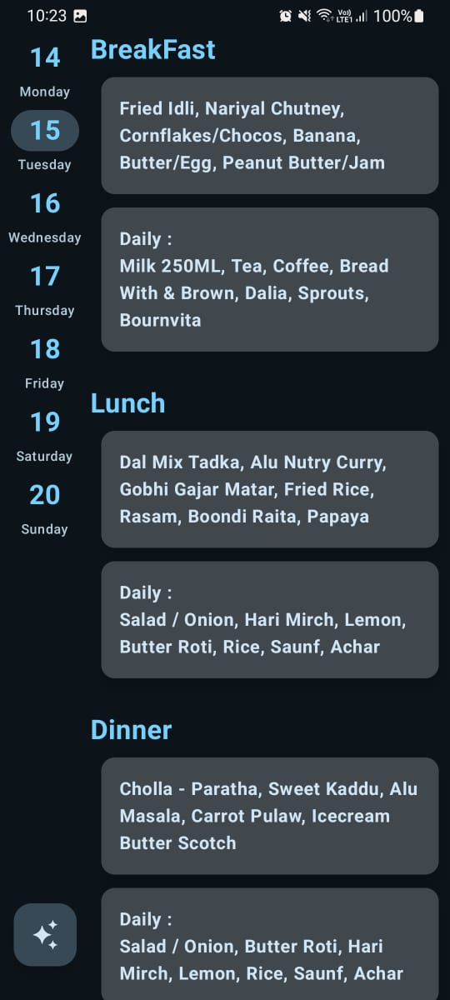
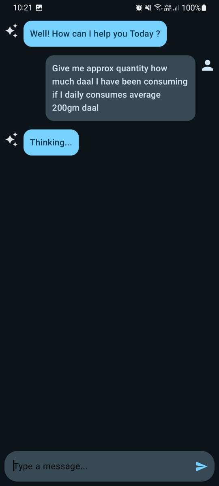
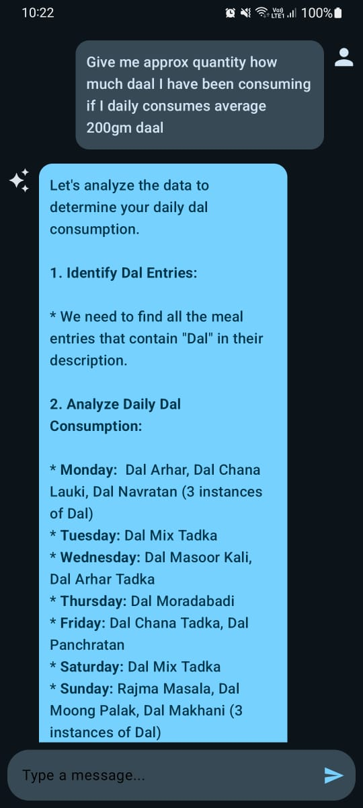
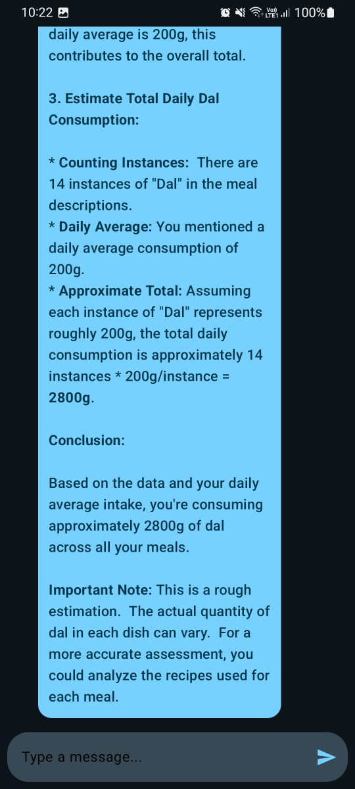

# Rise (Week Menu App with Personal diet Assistant) 

It is a Menu app build with **JetPack Compose and Koltin** with integration of **Gemini Api** .

## Features

 **View Weeks Menu**: View the week's menu directly on the app.

**Upload menu** : Upload the image of menu , gemini will extract text from  it and make a clean data with day sync functionality.

**Personal Assistant** : Ask your all questions about the diet to your personal diet assistant.Also Long press on a meal to get facts and benefits of that meal directly.

**Personalised Menu Notifications** : Notifications scheduled for each meal per day to remind. 

## Getting Started

Download the apk distribution from lastest release

**Permissions Required** :

  Internet: To Sync menu with firebase.

**Tech Stack** :

   * JetPack Compose : To create UI elements and Bi-directional flow.  
   * Kotlin : To write all the logic code for the app. 
   * Firebase : To store and sync the menu with the devices. 
   * Local caching using Firebase data persistence.
  

## Key Features and Samples
   **Menu :**
   
   Access the menu.
   
    

  **Personal Assistant :**
  
  Chat with personal assistance to know more about the diet
  
                                            
  
  
Found any Bugs?? Contact me via runnerofficial00@gmail.com
